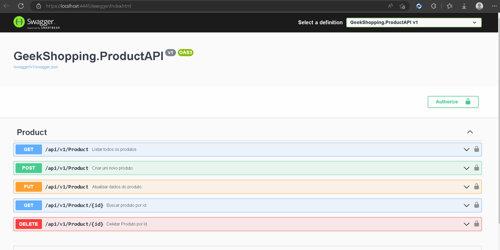
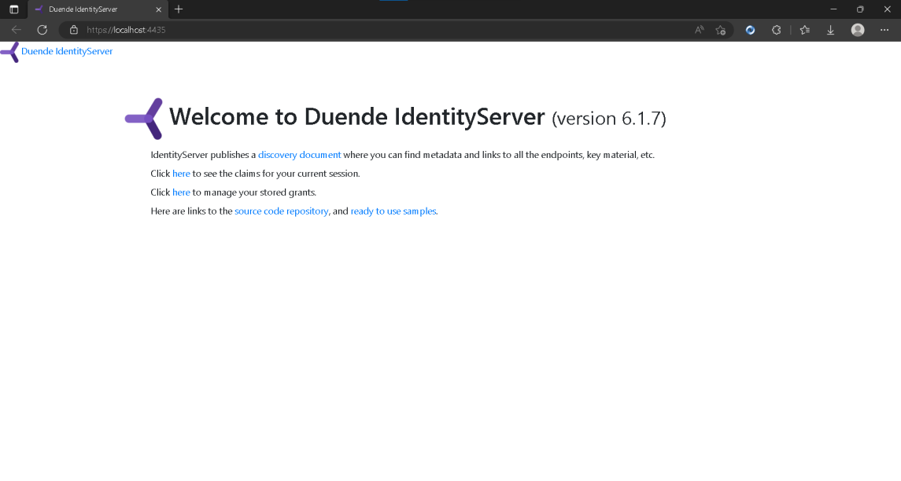

<div align="center">
   
</div>
<hr>

### 🖥️ Uma Loja virtual baseada em uma arquitetura de microsserviços .Net 6 afim de praticar conceitos visto. 📗.
<br>

<h1 style="font-weight:bold">Sobre</h1>
<p>
   Neste projeto há dois role, um para o admin e outro para o usuário comum, onde, apenas o admin tem autorização para fazer os CRUDs existentes, o usuário conseguirá apenas visualizar as funções. Conta com um padrão de autenticação JWT onde há um microsserviço próprio para o mesmo, se comunicando com os demais microsserviços para deixar em um nível de segurança maior para o usuário. Ha um front capaz de consumir as funcionalidades do projeto.
</p> 

<br>

<div class="imagens">

   <div class="Front">
      <h1 style="font-weight:bold">📌 FrontEnd</h1>
      <!-- <br> -->
      <ul>
         <li>O usuário não precisa estar logado para navegar pela home.</li>
         <li>Caso o usuário queira visualizar os detalhes, carrinho e produtos, precisa logar, caso contrário, não irá conseguir.</li>
         <li>Quando o usuário finaliza a compra, é enviado uma mensagem para o RabbitMQ onde essas mensagem são consumidas por todas as filas ligadas a ela.</li>
      </ul>
      <div align="center">
         
      </div>
   </div>

   <br>

   <div class="Swagger">
      <h1 style="font-weight:bold">📌 API de Produto</h1>
       <ul>
         <li>Todos os endipoints dos microsserviços são protegidos.</li>
         <li>Apenas o Admin tem autorização de fazer qualquer tipo de alteração.</li>
         <li>Precisa passar o Bearer e depois o token para acessar os endipoints.</li>
      </ul>
      <div align="center">
         
      </div> 
   </div>

   <br>

   <div class="Duende">
      <h1 style="font-weight:bold">📌 Duende IdentityServer</h1>
      <ul>
         <li>Serviço responsável pela autenticação.</li>
      </ul>
      <div align="center">
         
      </div> 
   </div>

</div>
<hr>

<br>

 > Tecnologias usadas:

+ MySql
+ CSS
+ Bootstrap
+ HTML
+ RabbitMQ
+ Docker

<br>

> Instruções para baixar.

Separei o projeto por pasta, e o que fui fazendo em cada uma. a pasta do projeto finalizado é 24, entrar na pasta e exutar apoenas ela. 
dentro de cada projeto, há uma pasta chamada **_Properties_** dentro desta pasta há um arquivo chamado **launchSettings** neste arquivo, você irá configurar a porta onde o projeto irá subir. <br> 
No arquivo chamado **_appsettings_** você ira configurar o banco de dados. há um arquivo .rar de como rodei o projeto em minha máquina e suas configurações. Não esqueçam de criar um banco de dados para os microsserviços de; <br>

```
- [x] geek_shopping_cart_api
- [x] geek_shopping_coupon_api
- [x] geek_shopping_email
- [x] geek_shopping_identity_server
- [x] geek_shopping_order_api
- [x] geek_shopping_product_api
```
No Visual Studio, Para adicionar as migrations, você já precisa ter o banco de dados de cada microsserviço correspondente.
<br>Na pasta Services é onde fica as APIs. Em cada projeto irá repetir o mesmo processo. Clicar com o dedo direito em cima do micrisserviço, clicar na opção: _open in Terminal_, quando abrir uma janela, rodar esse comando: **_dotnet ef migrations add AddNomeDaSuaMigration_** de um nome para sua migrations e depois que a pasta foi criada, rodar esse comando para atualizar o banco de dados: **_dotnet ef database update_**